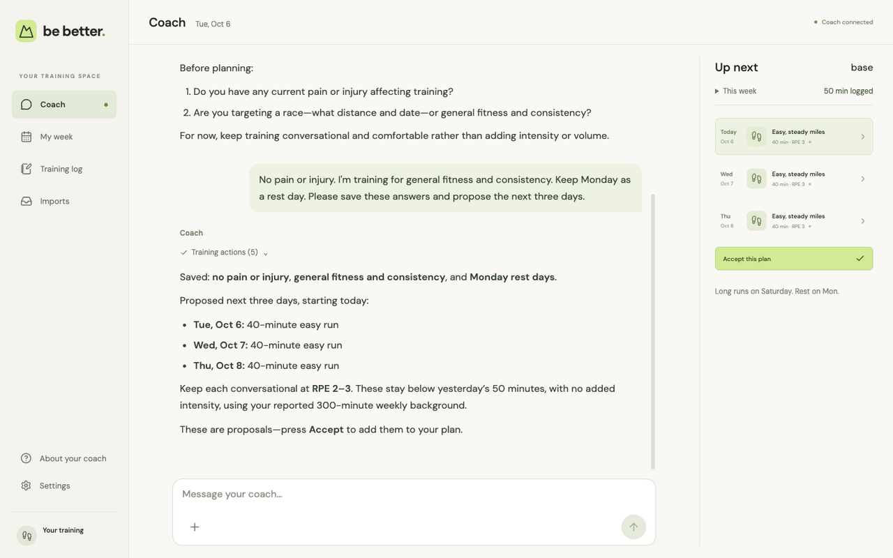
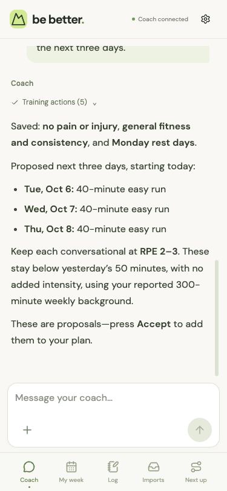
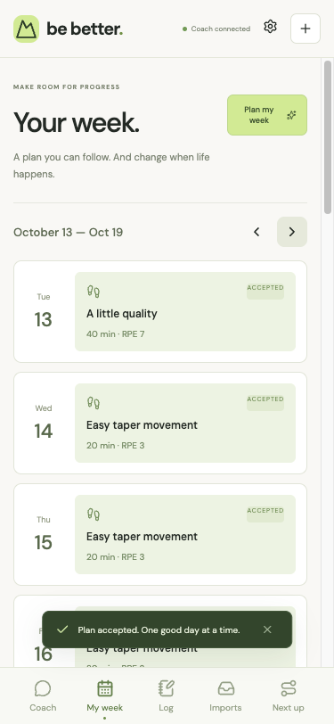

# Be Better

My personal endurance coach: a phone-first web app, a conversation with an AI coach, and one training log that I own.

<p align="center">
  
</p>
<p align="center">
  
  &nbsp;
  
</p>

## Why I built this

I wanted fitness software that I own and can keep changing as I use it.

So I built my own, mostly by combining a few good open-source projects and pointing an AI coach at my training log. Nothing here is proprietary and there's no secret sauce. It isn't a product or an attempt to compete with the big training platforms. It's personal software. It runs on my Mac, my phone reaches it over Tailscale, and when something doesn't fit how I train, I change the code.

The repo is public so others can see how it's put together, borrow pieces, or fork it and make their own version.

## What it does

- **Coach in a conversation.** The home screen is a chat with a coach that reads my log, asks about things that matter (pain, readiness, race dates, missed sessions), and proposes dated sessions, each with a target and a reason.
- **Plans I explicitly accept.** Nothing lands on my calendar until I press Accept. Changes to accepted sessions keep the original and a dated note explaining why.
- **Training programs.** I pick a goal and customize days, time budget, and supporting strength, then preview every dated week before committing. Programs include build phases, cutback weeks, tapers, and ultra back-to-backs. A library of 70 original example workouts is also available.
- **Logging, including lifting.** Runs, rides, and walks, plus strength sessions with exercises, sets, reps or timed holds, and weights.
- **Imports from anywhere.** A photo of a treadmill or watch screen, or a FIT, GPX, or TCX file, becomes a draft I review and confirm. Optional Intervals.icu sync adds workouts and fitness/fatigue/recovery analysis.
- **Honest about planned vs. actual.** Logging a workout never marks a planned session done on its own. I say whether it was completed, modified, replaced, or extra, and both the prescription and what really happened are kept.
- **Guardrails the AI can't bypass.** The API refuses unsafe writes such as back-to-back hard days, big long-run jumps, or hard training with an injury flag, whether they come from me or the model. The model also can't accept plans or confirm imports for me.
- **Exports.** Accepted sessions export to a calendar (ICS), text, FIT workout files, or Zwift ZWO for cycling.
- **Installable and offline-tolerant.** It's a PWA on my iPhone home screen. Offline, it shows the cached plan and queues photos to upload later.

The [user guide](docs/user-guide.md) walks through each screen.

## Built on the shoulders of

Most of this app is other people's good work, glued together:

- **[assistant-ui](https://github.com/assistant-ui/assistant-ui)** and the **[Vercel AI SDK](https://github.com/vercel/ai)**: the chat interface, streaming, and tool calls.
- **[Codex app-server](https://learn.chatgpt.com/docs/app-server)**: runs the coach on my existing ChatGPT subscription instead of a separate API bill. OpenAI and Anthropic API keys also work.
- **[fit-parser](https://github.com/jimmykane/fit-parser)**: reads and writes Garmin FIT files. **[fast-xml-parser](https://github.com/NaturalIntelligence/fast-xml-parser)** handles GPX and TCX.
- **[ai-running-coach](https://github.com/mmornati/ai-running-coach)** and **[claude-coach](https://github.com/felixrieseberg/claude-coach)**: the coaching ideas, like the shape of a training week, periodization phases, guardrails, decision notes, and the intake interview. No code is copied; the ideas are re-implemented here.
- **[Intervals.icu](https://intervals.icu)**: optional source of workouts and training-load analysis.
- **[Hono](https://hono.dev)**, **[SQLite](https://sqlite.org)** via better-sqlite3 and Drizzle, **[React](https://react.dev)**, **[Vite](https://vite.dev)** with vite-plugin-pwa, **[Zod](https://zod.dev)**, and **[Tailscale](https://tailscale.com)**.

[Open-source leverage](docs/research/open-source-leverage.md) is the survey I did before building, including what I deliberately left out and why (mostly AGPL/GPL licensing and Garmin's FIT SDK terms). [Third-party notices](THIRD_PARTY_NOTICES.md) has the license details.

## How it works

```text
iPhone (installed PWA)        Laptop browser
          \                     /
           \---- Tailscale ----/
                     │
           Hono API (one Node process)
            │        └── local Codex app-server ── ChatGPT subscription
            │              (typed app tools only)
            ▼
   CoachService + guardrails + import review
            │  transactions, version checks, decision notes
            ▼
   SQLite + original photos/files on disk
```

- **The training log is the memory.** The coach has no hidden memory store. Each conversation gets a bounded summary built from the SQLite log, so what the coach knows is what I can see and edit.
- **One write path.** The UI and the model call the same service, so the same validation and guardrails apply to both.
- **Single user, no accounts.** It binds to localhost and is reachable only over my private tailnet.
- **Locked-down coach runtime.** The model gets an empty workspace, no shell, and only the app's validated tools.

The repository layout:

| Path              | What's there                                                                           |
| ----------------- | -------------------------------------------------------------------------------------- |
| `apps/web`        | React PWA: coach, week, log, programs, imports, settings, offline cache, upload outbox |
| `apps/api`        | Hono API: routes, coach context, model connection, planning, imports, sync, exports    |
| `packages/domain` | Shared Zod schemas, training programs, workout library, units, and dates               |

## Run your own

You need Node 22.17+ and, for the coach, a ChatGPT subscription or an OpenAI or Anthropic API key. Without a model, the forms still work in a guided mode.

```sh
git clone https://github.com/BradyOnTech/be-better.git
cd be-better
npm ci
cp .env.example .env
npm run dev
```

Open http://localhost:5173 and sign in under **Settings → Connections**. Then fill in **Settings → Training**: timezone, rest days, recent weekly minutes, and longest recent run.

To use it on a phone, build it, run it as a service, and expose it privately with Tailscale. [Self-hosting](docs/self-hosting.md) covers the PWA install, the macOS LaunchAgent, backups, and restore.

## Making it yours

The whole point is that you change it. Some starting points:

- **Coaching behavior** lives in `apps/api/src/coach.ts` (prompt and tools) and `apps/api/src/guardrails.ts` (what gets refused).
- **Programs and workouts** are plain data in `packages/domain/src/programs.ts` and `packages/domain/src/workouts.ts`.
- **The domain language** (planned session vs. activity, session outcomes, decision notes) is defined in [GLOSSARY.md](GLOSSARY.md).
- **The original spec** is [docs/build-plan.md](docs/build-plan.md), and [docs/implementation-status.md](docs/implementation-status.md) logs what has been built and verified.

I build this mostly with AI coding agents. [AGENTS.md](AGENTS.md) holds the rules they follow: never put test data in the real log, keep secrets out of Git, and preserve the planned-vs-actual invariants. Machine-specific details live in an untracked `AGENTS.local.md`.

## Caveats

- This is built for one person: me. Expect opinions baked into the code, not configuration options.
- It's not medical advice, and the guardrails aren't a substitute for listening to your body or a real coach.
- Don't expose it to the public internet. There are no user accounts; keep it on localhost and a private network.
- I'm happy if you fork it. I may not respond to issues or merge pull requests, since I'm changing it to fit my own training.

## License

[MIT](LICENSE). Third-party components keep their own licenses. See [THIRD_PARTY_NOTICES.md](THIRD_PARTY_NOTICES.md).
