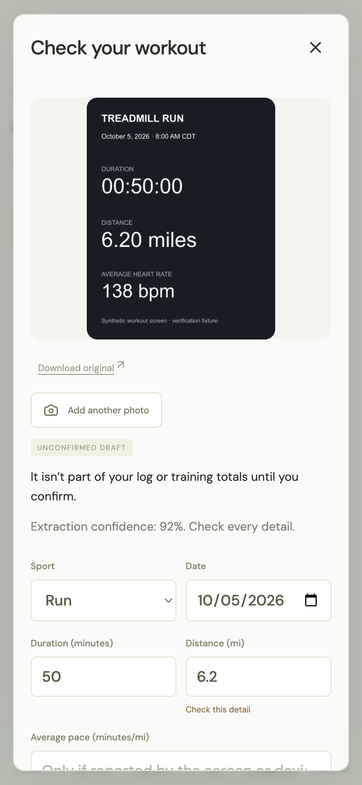
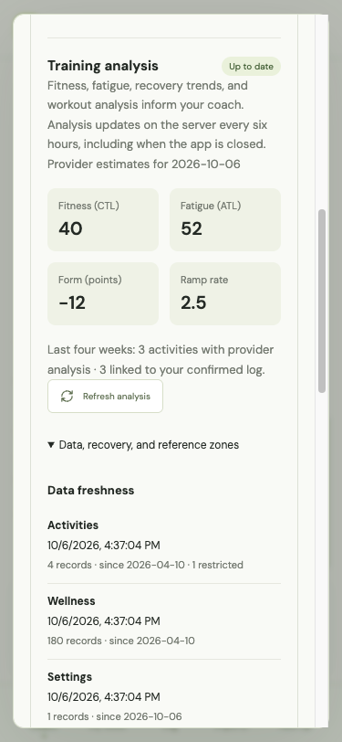

# Be Better

My personal endurance coach. Snap a photo of any workout screen and it's logged. Talk to an AI coach that runs on my ChatGPT subscription. Sync with Intervals.icu. Everything lands in one training log that I own.

<p align="center">
  
</p>
<p align="center">
  
  &nbsp;
  
</p>

## Why I built this

I wanted fitness software that I own and can keep changing as I use it.

So I built my own, mostly by combining a few good open-source projects and pointing an AI coach at my training log. Nothing here is proprietary and there's no secret sauce. It isn't a product or an attempt to compete with the big training platforms. It's personal software. It runs on my Mac, my phone reaches it over Tailscale, and when something doesn't fit how I train, I change the code.

The repo is public so others can see how it's put together, borrow pieces, or fork it and make their own version.

## What's interesting about it

### Snap a photo of any workout and it's logged

This is my favorite part. Not every workout syncs: the treadmill at the gym, a spin bike, a rower, a watch that isn't connected to anything. Instead of typing numbers in, I take a photo of the summary screen, or grab a screenshot from another app, and Be Better does the rest.

The model reads the screen into a strict workout schema: sport, date and time, duration, distance, reported pace or speed, heart rate, power, elevation, and cadence. It fills in a draft card for me. Fields it isn't sure about are flagged, it shows its confidence, and it never guesses things the screen doesn't show (effort, how I felt, pain, or a date that isn't visible). I glance at the card, fix anything that's off, and tap **Confirm**.

<p align="center">
  
</p>

- **Several photos, one workout.** Two screens of the same session (say the treadmill and the watch) become one draft.
- **Nothing counts until I confirm.** A draft never touches my training totals, and the original photo is kept and downloadable.
- **No duplicates.** If the same workout also arrives as a FIT file or from Intervals.icu, it attaches to the existing entry instead of counting twice.
- **Works offline.** No signal at the gym? The photo waits in an outbox on my phone and uploads when I reopen the app.
- **Files too.** FIT, GPX, and TCX files from any device go through the same review card.

It runs on the same ChatGPT subscription as the coach, so logging by photo costs nothing extra.

### It runs on my ChatGPT subscription, not an API key

Most AI apps need an API key and a separate pay-per-token bill. Be Better runs the coach through OpenAI's official [Codex app-server](https://learn.chatgpt.com/docs/app-server) on the server machine, so coaching and photo reading use the ChatGPT plan I already pay for.

- **Sign in from the phone.** Settings shows an official device-code link. Codex keeps the credentials in its own isolated directory, and no token ever reaches the browser or the app's database.
- **Usage limits in Settings.** The app shows the plan's live usage windows along with the model, reasoning effort, and connection status.
- **One set of tools, any provider.** The coach's tools are ordinary [Vercel AI SDK](https://github.com/vercel/ai) tools, and a small adapter hands them to Codex. The same tools work with an OpenAI or Anthropic API key if I'd rather pay per token.

### Intervals.icu integration

Be Better connects to [Intervals.icu](https://intervals.icu), so anything my devices already sync there (Garmin, Wahoo, Coros, and others) can flow in, and the coach gets real training-load and recovery data to work with.

- **Workout import.** One tap syncs the last four weeks of workouts. They arrive as review drafts like everything else. Unchanged records are skipped, edited ones come back as reviewable updates, and a workout I already logged by photo gets matched instead of duplicated. (Activities Intervals.icu received from Strava aren't available through its API; they're skipped with a visible count.)
- **Fitness, fatigue, and form.** The server refreshes Intervals.icu's fitness (CTL), fatigue (ATL), form, ramp rate, and weekly load every six hours, even when the app is closed.
- **Recovery trends.** HRV, resting heart rate, and sleep over the last seven days, compared against my own previous 28 days rather than population norms.
- **Workout detail for the coach.** The coach reads a summary of all this and can pull the interval breakdown of a specific session when it's relevant. It treats load numbers as estimates and says so when data is missing.
- **Zones and thresholds.** Sport settings from Intervals.icu can be reviewed and saved as my training zones.

<p align="center">
  
</p>

The integration is read-only and stays in its lane. Analysis never confirms a workout or changes the plan on its own, and provider load is kept separate from my own duration/effort numbers. The API key is checked on connect, stored only on the server, and never sent to the browser or the model.

### A coach that can't go rogue

The model runs locked down. It gets an empty working directory, read-only file access, no network, no shell, and no sub-agents. Its only abilities are the app's own validated tools, like reading the log or proposing a week.

Every write goes through the same server-side service as the UI, with the same guardrails. Back-to-back hard days, a third hard day in a week, long-run jumps over 20 minutes, hard training with an injury flag, and blown taper budgets are all refused, whether I asked for them or the model did. The model can propose, but it can't accept a plan, confirm an import, or sign me up for a program. Those buttons are mine.

### Planned vs. actual stays honest

Many apps quietly tick off a planned run when any run shows up that day. Be Better never infers that. After a workout I say whether it was **completed as planned**, **modified**, **replaced**, or **additional**, and the app keeps both the original prescription and what I actually did. Changes to an accepted plan get a dated decision note explaining why, so the history shows what was planned, what happened, and why they differ.

### The training log is the memory

There's no vector database or hidden memory store. Each conversation gets a fresh, bounded summary built from my SQLite log: workouts, plan, preferences, injuries, and dated notes. What the coach knows is exactly what I can see and edit, and threads can be thrown away without losing anything.

## Everything else

- **Training programs.** Pick a goal, customize days, weekly time budget, and supporting strength, then preview every dated week before committing. Programs include build phases, cutback weeks, tapers, and ultra back-to-backs. A library of 70 original example workouts is also available.
- **Lifting logs.** Exercises, sets, reps or timed holds, and weights in lb or kg, plus "copy last session."
- **Exports.** Accepted sessions export to a calendar (ICS), text, FIT workout files, or Zwift ZWO for cycling.
- **Installable.** It's a PWA on my iPhone home screen, with a cached read-only view when offline and an **Update now** prompt when I deploy a change.
- **Works without a model.** A guided mode keeps the forms and basic proposals working before sign-in.

The [user guide](docs/user-guide.md) walks through each screen.

## Built on the shoulders of

Most of this app is other people's good work, glued together:

- **[assistant-ui](https://github.com/assistant-ui/assistant-ui)** and the **[Vercel AI SDK](https://github.com/vercel/ai)**: the chat interface, streaming, and tool calls.
- **[Codex app-server](https://learn.chatgpt.com/docs/app-server)**: runs the coach on my existing ChatGPT subscription instead of a separate API bill. OpenAI and Anthropic API keys also work.
- **[fit-parser](https://github.com/jimmykane/fit-parser)**: reads and writes Garmin FIT files. **[fast-xml-parser](https://github.com/NaturalIntelligence/fast-xml-parser)** handles GPX and TCX.
- **[ai-running-coach](https://github.com/mmornati/ai-running-coach)** and **[claude-coach](https://github.com/felixrieseberg/claude-coach)**: the coaching ideas, like the shape of a training week, periodization phases, guardrails, decision notes, and the intake interview. No code is copied; the ideas are re-implemented here.
- **[Intervals.icu](https://intervals.icu)**: workout sync plus fitness, fatigue, and recovery analysis.
- **[Hono](https://hono.dev)**, **[SQLite](https://sqlite.org)** via better-sqlite3 and Drizzle, **[React](https://react.dev)**, **[Vite](https://vite.dev)** with vite-plugin-pwa, **[Zod](https://zod.dev)**, and **[Tailscale](https://tailscale.com)**.

[Open-source leverage](docs/research/open-source-leverage.md) is the survey I did before building, including what I deliberately left out and why (mostly AGPL/GPL licensing and Garmin's FIT SDK terms). [Third-party notices](THIRD_PARTY_NOTICES.md) has the license details.

## How it works

```text
iPhone (installed PWA)        Laptop browser
          \                     /
           \---- Tailscale ----/
                     │
           Hono API (one Node process)
            │        └── local Codex app-server ── ChatGPT subscription
            │              (typed app tools only)
            ▼
   CoachService + guardrails + import review
            │  transactions, version checks, decision notes
            ▼
   SQLite + original photos/files on disk
```

- **One write path.** The UI and the model call the same service, so the same validation and guardrails apply to both.
- **One process, one file.** The API serves the built PWA, the whole log is a single SQLite file next to its original uploads, and a backup is a copy of both.
- **Single user, no accounts.** It binds to localhost and is reachable only over my private tailnet.

The repository layout:

| Path              | What's there                                                                           |
| ----------------- | -------------------------------------------------------------------------------------- |
| `apps/web`        | React PWA: coach, week, log, programs, imports, settings, offline cache, upload outbox |
| `apps/api`        | Hono API: routes, coach context, model connection, planning, imports, sync, exports    |
| `packages/domain` | Shared Zod schemas, training programs, workout library, units, and dates               |

## Run your own

You need Node 22.17+ and, for the coach, a ChatGPT subscription or an OpenAI or Anthropic API key. Without a model, the forms still work in a guided mode.

```sh
git clone https://github.com/BradyOnTech/be-better.git
cd be-better
npm ci
cp .env.example .env
npm run dev
```

Open http://localhost:5173 and sign in under **Settings → Connections**. Then fill in **Settings → Training**: timezone, rest days, recent weekly minutes, and longest recent run.

To use it on a phone, build it, run it as a service, and expose it privately with Tailscale. [Self-hosting](docs/self-hosting.md) covers the PWA install, the macOS LaunchAgent, backups, and restore.

## Making it yours

The whole point is that you change it. Some starting points:

- **Coaching behavior** lives in `apps/api/src/coach.ts` (prompt and tools) and `apps/api/src/guardrails.ts` (what gets refused).
- **Programs and workouts** are plain data in `packages/domain/src/programs.ts` and `packages/domain/src/workouts.ts`.
- **The domain language** (planned session vs. activity, session outcomes, decision notes) is defined in [GLOSSARY.md](GLOSSARY.md).
- **The original spec** is [docs/build-plan.md](docs/build-plan.md), and [docs/implementation-status.md](docs/implementation-status.md) logs what has been built and verified.

I build this mostly with AI coding agents. [AGENTS.md](AGENTS.md) holds the rules they follow: never put test data in the real log, keep secrets out of Git, and preserve the planned-vs-actual invariants. Machine-specific details live in an untracked `AGENTS.local.md`.

## Caveats

- This is built for one person: me. Expect opinions baked into the code, not configuration options.
- It's not medical advice, and the guardrails aren't a substitute for listening to your body or a real coach.
- Don't expose it to the public internet. There are no user accounts; keep it on localhost and a private network.
- I'm happy if you fork it. I may not respond to issues or merge pull requests, since I'm changing it to fit my own training.

## License

[MIT](LICENSE). Third-party components keep their own licenses. See [THIRD_PARTY_NOTICES.md](THIRD_PARTY_NOTICES.md).
